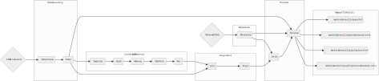

# Webis-STEREO-21 Corpus

This is the code repository containing all resources used to build the Webis-STEREO-21 corpus on scientific text reuse in open access publications.

It consists of general-purpose spark jobs for scalable text reuse detection in large document collections.

## Organization

Each stage of the pipeline is defined as a separate file in the `jobs` directory. Alongside, each job has an associated submit script to handle resource alloaction on a spark cluster in the the `scripts` directory.
Located in the `tools` directory, the source code for standalone alignment component (written in Go) a standalone converter for Grobid output is located. 
The `analysis-example.ipynb` notebook features an exemplary analysis of the Webis-STEREO-21 corpus as a starting point to facilitate data reuse.

## Usage

Each job can be invoked to run either locally or on the cluster. See the makefile for available predefined targets.

Resource allocation is handled by the submit script associated with each job.

## Jobs

###### [1. Preprocess](jobs/preprocess.py)

`make preprocess-cluster` (cluster mode using the corresponding [submit script](scripts/submit-preprocess.sh)) or `make preprocess-local` (local mode)

Reads the stereo document collection from S3 and converts them to a standardized (id, content) format.

| Parameter | Description | Default                               |
| :-------- | :---------- |:--------------------------------------|
| input_path | Path to read data from | `<YOUR INPUT GROBID DUMP HERE>`       |
| output_path | Path to write data to | `stereo-grobid-preprocessed.parquet` |

###### [2. Filter (Optional)](jobs/filter.py)

`make filter-cluster` (cluster mode using the corresponding [submit script](scripts/submit-filter.sh)) or `make filter-local` (local mode)

Reads the preprocessed stereo document collection and filters the subset specified by the supplied list of DOIs.

| Parameter | Description | Default |
| :-------- | :---------- | :-------|
| input_path | Path to read data from | `stereo-grobid-preprocessed.parquet` |
| output_path | Path to write data to | `stereo-filtered.parquet` |

###### [3. Vectorize](jobs/vectorize.py)

`make vectorize-cluster` (cluster mode using the corresponding [submit script](scripts/submit-vectorize.sh)) or `make vectorize-local` (local mode)

Splits each document into sequential fixed-size chunks and represents each chunk as binary term vector.

| Parameter | Description | Default |
| :-------- | :---------- | :-------|
| input_path | Path to read data from | `stereo-filtered.parquet/*` |
| output_path | Path to write data to | `stereo-vectorized.parquet` |
| ngram_length | Length of chunks documents are split into | `50` |
| num_features | Dimension of word feature vector for each chunk | `2**18` |

###### [4. Hash](jobs/hash.py)

`make hash-cluster` (cluster mode using the corresponding [submit script](scripts/submit-hash.sh)) or `make hash-local` (local mode)

Calculates a set of hashes for each feature vector to enable MinHash similarity detection.

| Parameter | Description | Default |
| :-------- | :---------- | :-------|
| input_path | Path to read data from | `stereo-vectorized.parquet/*` |
| output_path | Path to write data to | `stereo-hashed.parquet` |
| num_hashes |  Number of hashes for the MinHash calculation. Allows for 1/*n* Jaccard distance precision with *n* hashes | `5` |

###### [5. Reduce](jobs/reduce.py)

`make reduce-cluster` (cluster mode using the corresponding [submit script](scripts/submit-reduce.sh)) or `make reduce-local` (local mode)

Encodes the hashset of each chunk as one-hot binary vector. Reduces chunks of one document into one vector using logical OR on the binary vectors.

| Parameter | Description | Default |
| :-------- | :---------- | :-------|
| input_path | Path to read data from | `stereo-hashed.parquet/*` |
| output_path | Path to write data to | `stereo-reduced.parquet` |
| num_features | Number of dimensions for the binary document vector | `2**18` |

###### [6. Partition](jobs/partition.py)

`make partition-cluster` (cluster mode using the corresponding [submit script](scripts/submit-partition.sh)) or `make partition-local` (local mode)

Builds an inverted list of hash->doi pairs and partitions it by hash. Allows for efficient batching of the pairing job.

| Parameter | Description | Default |
| :-------- | :---------- | :-------|
| input_path | Path to read data from | `stereo-reduced.parquet/*` |
| output_path | Path to write data to | `stereo-partitioned.parquet` |
| num_partitions | Number of partitions to split the index into | `5000` |
 
###### [7. Pair](jobs/pair.py)

`make pair-cluster` (cluster mode using the corresponding [submit script](scripts/submit-pair.sh)) or `make pair-local` (local mode)

Transforms document vectors into document pairs. Each pair denotes documents that share at least one hash across all chunks. Works by filtering the cartesian product of documents by all pairs that have at least one "1" in the logical AND of their binary document vectors.

Operates in batches. Recommended is using 100 batches at least ("00" to "99").

| Parameter | Description | Default |
| :-------- | :---------- | :-------|
| input_path | Path to read data from | `stereo-partitioned.parquet/*` |
| output_path | Path to write data to | `stereo--paired.parquet` |
| batch | Unix file wildcard to identify the `part-*` files used in this batch | `"00"` |

###### [8. Join](jobs/join.py)

`make join-cluster` (cluster mode using the corresponding [submit script](scripts/submit-join.sh)) or `make join-local` (local mode)

Joins the pair dataframe with the corresponding texts in each row.

| Parameter | Description | Default |
| :-------- | :---------- | :-------|
| input_path | Path to read data from | `stereo-paired.parquet/*` |
| output_path | Path to write data to | `stereo-joined.parquet` |
| batch | Batch to join on (recommended 100 batches) | `00` |

###### [9. Align](jobs/align.py)

`make align-cluster` (cluster mode using the corresponding [submit script](scripts/submit-align.sh)) or `make align-local` (local mode)

Produces the exact alignment of all given document pairs. Operates in batches similar to the join job.

| Parameter | Description | Default |
| :-------- | :---------- | :-------|
| pair_path | Path to read data from | `stereo-paired.parquet/*` |
| text_path | Path to read data from | `stereo-filtered.parquet/*` |
| output_path | Path to write data to | `stereo-aligned.parquet` |
| batch | Batch prefix from the join job | `"00"` |
| NGRAM_LENGTH | | 8 |
| NGRAM_OVERLAP | | 7 |
| THETA | | 250 |

###### [10. Metadata](jobs/metadata.py)

`make metadata-cluster` (cluster mode using the corresponding [submit script](scripts/submit-metadata.sh)) or `make metadata-local` (local mode)

Extracts metadata from the Microsoft Open Academic Graph Dataset and maps them to the [DFG classification of scientific disciplinces](https://www.dfg.de/download/pdf/dfg_im_profil/gremien/fachkollegien/amtsperiode_2016_2019/fachsystematik_2016-2019_en_grafik.pdf).

| Parameter  | Description | Default |
| :--------  | :---------- | :-------|
| input_path | Path to read data from | `file:/mnt/ceph/storage/corpora/corpora-thirdparty/corpus-microsoft-open-academic-graph-v1/*.txt` |
| output_path| Path to write data to | `stereo-oag.parquet` |

###### [11. Unify](jobs/unify.py)

`make unify-cluster` (cluster mode using the corresponding [submit script](scripts/submit-unify.sh)) or `make unify-local` (local mode)

Joins metadata and reuse cases.

| Parameter  | Description | Default |
| :--------  | :---------- | :-------|
| case_path | Path to read case data from | `stereo-core-aligned.parquet/*/*` |
| metadata_path | Path to read metadata from | `stereo-metadata.parquet/*` |
| output_path| Path to write data to | `stereo-corpus.jsonl` |

###### [12. Finalize](jobs/finalize.py)

`make finalize-cluster` (cluster mode using the corresponding [submit script](scripts/submit-finalize.sh)) or `make finalize-local` (local mode)

Transforms each data record into its final form, filters publication metadata, and assigns unique IDs to each case. 

| Parameter  | Description | Default |
| :--------  | :---------- | :-------|
| case_path | Path to read case data from | `stereo-core-aligned.parquet/*/*` |
| text_path | Path to read publication text data from | `stereo-core-aligned.parquet/*/*` |
| metadata_path | Path to read metadata from | `stereo-metadata.parquet/*` |
| output_cases_full | Path to write case data to | `webis-stereo21/cases-full` |
| output_cases_metadata_only | Path to write metadata-only case data to | `webis-stereo21/cases-metadata-only` |
| output_publications_full | Path to write publication data to | `webis-stereo21/publications-full` |
| output_publications_metadata_only | Path to metadata-only publication data to | `webis-stereo21/publications-metadata-only` |
